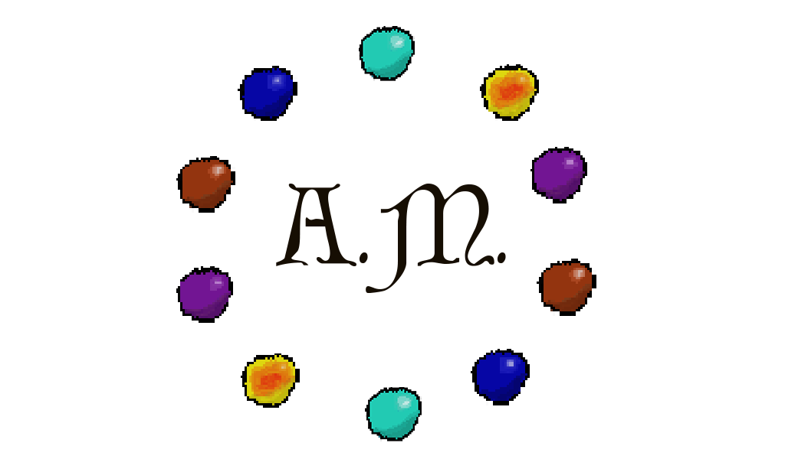

  

<h3 align="center">RPG Ardens Missus </h3>

 RPG realizado como trabalho da avaliação 3 para a disciplina de Linguagem de Programação II, lecionada por Marcos Lapa.
     

## 📝 Sumário

- [História geral](#historia)
- [História Aequor](#historiaAequor)
- [História Caeli](#historiaCaeli)
- [História Ignis](#historiaIgnis)
- [História Savi](#historiaSavi)
- [Iniciando](#inicio)
- [Preparando Uso](#preparando)
- [Como jogar](#como-usar)
- [Tecnologias Usadas](#tecnologias-usadas)
- [TODO](./TODO.md)
- [Contribuindo](./CONTRIBUTING.md)
- [Desenvolvedoras](#desenvolvedoras)
- [O jogo](#o-jogo)
- [Personagens encontrados](#personagens)
- [Mecânica do jogo](#mecanica)

## 🧐 História geral 

Em um futuro pós apocalíptico, após a Grande Guerra Nuclear, os seres humanos sofreram alteração genética em seu DNA devido à radiação, desenvolvendo poderes e habilidades. As feiticeiras ascenderam logo após a reestruturação da sociedade, comandando pequenas tribos. Porém, quando os homens percebem que elas estavam tomando grande parte do poder, um homem e seus aliados armaram um plano para seduzir a feiticeira mais poderosa. Eles descobriram em uma caverna 5 pedras, cada uma influenciava um dos elementos da natureza, água, fogo, terra, ar e a magia, juntas uma anula o efeito da outra, mas separadas tinham um enorme poder. Assim a Imperium Liberium, a Pedra da Magia, enfraquecia os poderes das feiticeiras, dessa forma quando o homem ganhou o coração da feiticeira ele deu como presente para provar seu amor, uma gargantilha com essa pedra, aprisionando-a.
 
Quando ele enfraquece a líder mais poderosa, ele e seus aliados conseguiram aprisionar as principais feiticeiras, assim, tomando o poder. Após isso, as próximas gerações de feiticeiras foram ensinadas a adorar a pedra, utilizando seus poderes enfraquecidos apenas para servi-los, sem conhecer a verdade e impossibilitadas de explorar seu verdadeiro potencial.
 
1000 anos depois da queda, o Rei dos humanos se apaixona por uma feiticeira e decide torná-la sua rainha, contudo como elas são proibidas de assumir qualquer posição de poder, ela esconde sua verdadeira face do rei, para poder continuar com ele, tendo uma filha. Infelizmente, após alguns anos, o povo descobre seu segredo, realizando uma revolução. Nesse mesmo período, temendo o pior, a feiticeira conta a sua filha sobre seu poder e os riscos que correm, mandando-a fugir para a floresta com a Pedra da Terra à procura de uma anciã antes que encontrem a menina. Com isso, os "revolucionários" tomaram o poder matando o Rei e a Rainha. Assim, a Princesa começa a sua jornada, onde terá que recolher em cada um dos reinos das terras Ardens Missus as outras três Pedras Elementais, retornando ao seu reino para enfrentar o novo Rei dos Humanos, recuperar a Pedra da Magia e libertar as feiticeiras da escravidão.

## 🌊 História Aequor 

O Reino Aequor é habitado pelo povo Sereiano, localizado na parte litorânea de Ardens Missus, antes da Grande Guerra Nuclear o Reino era composto por diversas vilas de pescadores e piratas. Assim, por viverem na costa, constantemente em contato com o mar, a radiação os fez desenvolver caudas e os tornou capaz de respirar embaixo da água. O Rei dos Sereianos é o guardião da Pedra da Água, conhecido por ser um guerreiro cuidadoso e saber toda a história de Ardens Missus, ele prevê os movimentos de seus inimigos e é capaz de roubar seu fôlego, rompendo até mesmo o mais poderoso feitiço de respiração. Para vencer o sábio rei é importante saber a hora de descansar.

## ☁️ História Caeli 

O Reino Caeli é habitado pelas Fadas, localizado nas cadeias montanhosas de Ardens Missus, mesmo antes da Grande Guerra Nuclear o povo das montanhas  vivia em grandes altitude, acostumados ao ar rarefeitos e a escalar até os picos mais altos. Depois da onda de radiação, aqueles que moravam lá desenvolveram asas e uma estrutura corporal leve para o voo. O Rei das Fadas é o guardião da pedra do Ar, mas não se deixe enganar pelo título, apesar de sua descendência nobre, esse rei luta sem a menor elegância, roubando a proteção de seus oponentes sem nunca demonstrar misericórdia. Contra o Rei das Fadas você não deve poupar escudo, mas não exite em usar o seu ataque mais forte.

## 🔥 História Ignis 

O Reino Ignis é habitado pelos Bárbaros, localizado no Norte de Ardens Missus, antes da Grande Guerra Nuclear seu povo era composto de ferreiros que forjavam as melhores armas com o calor dos vulcões do Norte. Dessa forma, a radiação alterou o DNA dos ferreiros, dando a eles uma enorme força física. O Rei dos Bárbaros é o guardião da Pedra do Fogo, sua natureza é impulsiva, e seu instinto é o ataque, não se surpreenda se esse for o resumo de seu combate. A fraqueza de seus inimigos o fortalece, assim, você precisa derrotá-lo o mais rápido possível. Provavelmente, só haverá uma chance para executar o seu melhor golpe, e ele precisa ser surpreendente.

## 🏰 História Savi 

O Reino Savi é habitado pelos humanos, localizado no Sul de Ardens Missus, os humanos desse reino não sofreram alteração em sua estrutura genética, antes da Grande Guerra Mundial eram um povo composto por comerciantes, concentrando as principais rotas de comércio de Ardens Missus, se tornando assim o reino mais rico. O Rei dos Humanos é o guardião da Pedra da Terra e da Pedra da Magia, e apesar de manter as aparências, não é difícil notar seu ar de superioridade, sempre subestimando os seus inimigos. Assim, quando está em combate, este rei é capaz de enganar as defesas inimigas, e por esse motivo, contra os humanos, o ataque é a melhor defesa.
 
 ## 🏁 Iniciando 

Ter a extensão para C# no Visual Studio ou Visual Studio Code.

### Pré-requisitos

O que você precisa antes de instalar o seu projeto e instruções de como os instalar.
 
 ## 🚀 Preparando Uso 

Escolha da feiticeira que jogará.

## 🎈 Como jogar 

Instruções de como jogar.

### ✍️ Regras do jogo: 

* O personagem aparece no começo do labirinto de cada fase
* O jogador, utilizando as setas do teclado, pode mover-se pelo labirinto, devendo chegar ao fim antes que o tempo acabe
* Recompensas estão espalhadas pelo labirinto, coletá-las é opcional
* Após completar o labirinto o usuário pode ir diretamente para a batalha, ou acessar a mochila
* A mochila exibe todo o inventário do jogador, e a partir dela  é possível acessar a loja
* As moedas são utilizadas para comprar itens na loja

## ⛏️ Tecnologias Usadas 

## ✍️ Desenvolvedoras 
- [@anatartari](https://github.com/anatartari)
- [@biacalazans](https://github.com/biacalazans)
- [@fernandanlisboa](https://github.com/fernandanlisboa)
- [@AmadoMaria](https://github.com/AmadoMaria)

## 🎈 O jogo 

### ✍️ Raças 

* Feiticeiras
* Fadas
* Sereianos
* Barbaros 
* Humanos

### ✍️ Reinos

* 🌳 Floresta Proíbida
* 🌊 Reino Aequor
* ☁️ Reino Caeli
* 🔥 Reino Ignis
* 🏰 Reino Savi

### 🌈 Fases: 
* Cada fase é composta por um labirinto e uma batalha de turnos respectivamente, com exceção da fase final, que possui apenas uma batalha;
* Dentro do labirinto o jogador pode coletar itens e moedas.
* Antes de cada batalha o jogador tem acesso a sua mochila. Nela,o jogador pode escolher dois itens para usar durante a batalha de turnos. 
   Alem disso, da mochila o jogador pode acessar a loja, onde as moedas coletadas podem ser trocadas por itens.
* Durante a batalha de turnos, o jogador luta contra um NPC, podendo:
  ** Atacar
  ** Usar Escudo
  ** Descansar
  ** Usar um item
  ** Usar Ataque Especial
* Entre as etapas do labirinto e da batalha de turnos é pssível ler a história do reino correspondente, clicando na pedra daquele reino;

#### 1ª fase:
* Local: Reino Aequor
* Raça presente: Sereiano
* Recompensas: Pedra da água
* Bônus: 10 moedas, maior ganho de estamina por turno

#### 2ª fase:
* Local: Reino Caeli
* Raça presente: Fadas
* Recompensas: Pedra do Ar
* Bônus: 5 moedas, e uma poção fortalecedora

#### 3ª fase:
* Cenário: Reino Ignis
* Raça presente: bárbaros 
* Recompensas: Pedra do Fogo
* Bônus: Aumento da força, e uma ppoção Vitae

#### Fase final:
*	Cenário: Floresta Proibída
* Raça presente: humanos
* Recompensas: Fim da opressão

## ⚙️ Mecânica:

### Itens extra:
* Poção Taurus Rubber: Recupera instantâneamente 0,3 pontos de estamina.
* Poção radix: Aumenta 15 pontos de escudo.
* Pó de pirlimpimpim: Aumenta a magia da feiticeira em 20%.
* Poção vitae: Aumenta a vida em 30 pontos

### Mecânica dos personagens:
* Todos os personagens possuem uma quantidade de vida, força e defesa. Atributos como defesa e força podem mudar de acordo com o tipo de criatura.
* O jogador possuirá uma mochila para armazenar seus itens.
* Apenas o personagem do jogador pode possuir moedas.
* Ao avançar o jogo, o jogador pode aumentar o valor dos seus atributos a partir de bônus.

### Mecânica das batalhas de turnos:
O jogador poderá escolher entre ataque normal e ataque especial na batalha de turnos.
* Tipo: turnos
* Visão: 2D frontal
O jogador e o NPC possuirão um valor de vida, escudo e estamina.
Ex: Se o o jogador joga com o escudo e o NPC com ataque, o jogador perde na porcentagem do escudo, e o NPC na estamina.

### Mecânica do Labirinto:
* Durante o Labirinto o jogador pode se mover usando as setas do teclado;
* A personagem poderá coletar itens e moedas, antes que o tempo acabe;
* Se o jogador não sair do labirinto antes que o tempo acabe, o labirinto começará novamente;

### ✍️ Personagens do jogo: 

contar a história (rápida) de cada personagem e sua personalidade

### ✍️ Mecânica do jogo: 
os cálculos ficarão aqui

##### Jogador (início do jogo):
* Personagem: Principal (Feiticeira);
* Ataque = Força * Estamina;
* Dano = Ataque - Escudo do inimigo (caso esteja ativo);
* Ataque Especial = Força * Estamina * Magia; 
* Estamina: 1 -> a cada ataque uma porcentagem é retirada -> A cada turno a estamina é recuperada;
* Ganho de Estamina (por turno) = 0,3;
* Perda de Estamina (por ataque) = 0,12;
 
### Início do Jogo:
* O usuário sempre joga como uma feiticeira;
* Vida: 100;
* Moedas: 0;
* Força: 20;
* Escudo: 50;
* Magia = 1,2;
* Itens na mochila: 0;

### Chefe da Fase:
##### Atributos
* Escudo = varia de acordo com o chefe da fase;
* Ataque = Força * Estamina;
* Dano = Ataque - Escudo do inimigo (caso esteja ativo);
* Ataque especial = varia de acordo com o chefe da fase;

#### Rei dos sereianos
* Vida: 100;
* Força: 20;
* Escudo: 50;
* Estamina: 1 -> a cada ataque uma porcentagem é retirada -> A cada turno a estamina é recuperada;
* Ganho de Estamina (por turno) = 0,15;
* Perda de Estamina (por ataque) = 0,25;
* Ataque especial: A cada oito rodadas zera a estamina do seu oponente, porém precisa estar com a sua estamina em no mínimo 85%;

#### Rei das fadas
* Vida: 100;
* Força: 25;
* Escudo: 55;
* Estamina: 1 -> a cada ataque uma porcentagem é retirada -> A cada turno a estamina é recuperada;
* Ganho de Estamina (por turno) = 0,18;
* Perda de Estamina (por ataque) = 0,3;
* Ataque especial:Tendo mais de 60% de estamina a Fada consegue "Roubar o escudo da feiticeira em 10 pontos

#### Rei dos bárbaros
* Vida: 100;
* Força: 30;
* Escudo: 70;
* Estamina: 1 -> a cada ataque uma porcentagem é retirada -> A cada turno a estamina é recuperada;
* Ganho de Estamina (por turno) = 0,2;
* Perda de Estamina (por ataque) = 0,4;
* Ataque especial:  Rouba a metade da estamina da Feiticeira e em seguida ataca;

#### Rei dos Humanos
* Vida: 100;
* Força: 30;
* Escudo: 40;
* Estamina: 1 -> a cada ataque uma porcentagem é retirada -> A cada turno a estamina é recuperada;
* Ganho de Estamina (por turno) = 0,1;
* Perda de Estamina (por ataque) = 0,2;
* Ataque especial: Caso o a estamida seja maior que 80% ele pode desativar o escudo da feiticeira e dar um "Contra-Ataque".

